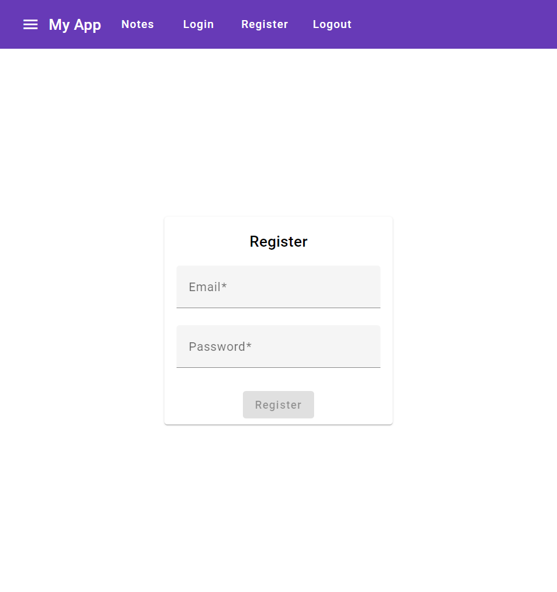
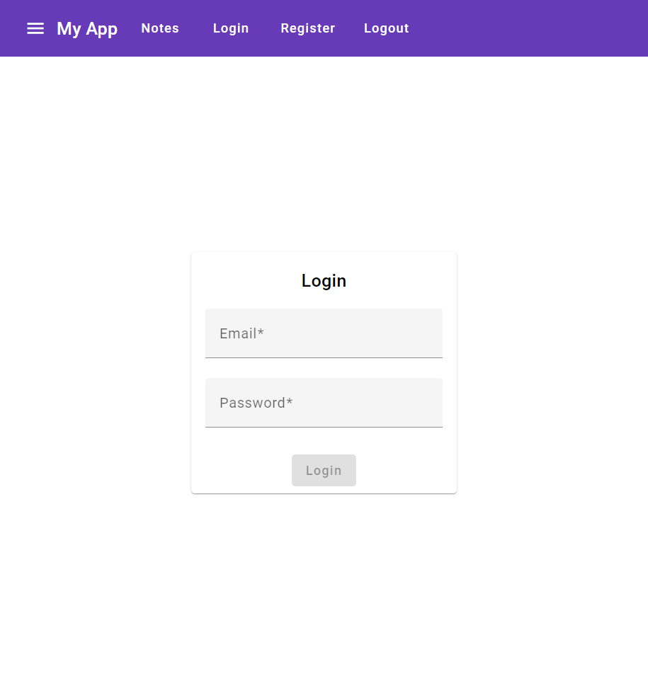

# Secure Notes App

A full-stack appliation for creating and managing securly stored notes. Privacy and data security are encured by using advanced encryption mechanisms. After logging in, a user can leave a public note or secure it with a password that can be shared between users. This application is created using Java's Spring Boot framework and Angular.

## Table of Contents
* [Features](#features)
  * [User features](#user-features)
  * [Security features](#security-features)
* [Used technologies](#used-technologies)
  * [Back-end](#back-end) 
  * [Front-end](#front-end)
  * [Infrastructure](#infrastructure)
* [Security](#security)
* [Installation](#installation)
* [Screenshots](#screenshots)

## Features

### User features
* Register a new user account
* Warn about weak password while creating an account
* Login with email & password
* Create a publicly available note
* Create a publicly available note encrypted with a seperate password
* Use basic text formatting while writing a note
* Create a publicly available note accessed by entering a password
* Retireve a list of all public notes
* Retrieve the content of a note
* Edit a note
* Delete a note

## Security features

* Communication between the server and client is secured by HTTPS protocol and CORS policy
* All passwords and encrypted notes' content are stored in encrypted form

## Used technologies

### Front-end
* Angular 17
* Angular Material
* TypeScript
* SCSS
* RxJS

### Back-end
* Java 17
* Spring Boot
* Maven
* Lombok
* PostgreSQL Database

### Infrastructure
* Docker
* ngInx

## Security

Before saving password are encrypted using 'Argon2' algorithm. When trying to authenticate is being compared with typed encrypted password.

Secured notes are encrypted while creating and deprycted while receiving using 'AES/CBC/PKCS5Padding' algorithm.

## Installation
1. Clone the repository to your local machine using Git:

   ```bash
   git clone https://github.com/sebastian-pietrykowski/secure-notes.git
   cd secure-notes
   ```

2. Run the application:

   ```bash
   docker compose up
   ```

   The application will be accessible at [https://localhost](https://localhost).

## Screenshots

### Register

<div align="center">
    
</div>
<div align="center">
    
</div>
<div align="center">
    
</div>

### Login

<div align="center">
    
</div>
<div align="center">
    
</div>

### Notes

<div align="center">
    
</div>

### Create a note

<div align="center">
    
</div>

### Unencrypted note details

<div align="center">
    
</div>

### Encrypted note details before decoding

<div align="center">
    
</div>

### Encrypted note after decoding

<div align="center">
    
</div>

### Security lock

<div align="center">
    
</div>

### Security connection

<div align="center">
    
</div>
